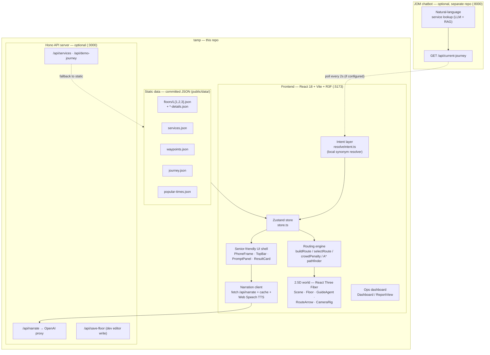

# OTH Navigator — senior-friendly indoor wayfinding for Our Tampines Hub

> 🏆 **5th place — Tampines AI JOM Hackathon (2026).** A bilingual, accessibility-aware
> indoor navigator that walks visitors through Singapore's **Our Tampines Hub (OTH)**
> in a stylised 2.5D model, with an AI guide that adapts the route to mobility needs
> and live counter crowding.

This repo is **tamp** — the map / navigation half of the project. It pairs with a
separate AI chatbot ("JOM") that does the natural-language service lookup, but it
**also runs fully standalone**: clone, install, run, and you get the whole map
experience with no API keys and no second server.

---

## The problem

Our Tampines Hub is Singapore's largest integrated community hub — 8 floors, ~30+
tenants and services from 6 different government agencies, serving 250,000 residents.
Everything is under one roof, which is exactly why people get lost. The pain is
sharpest for the people who most prefer in-person service:

- **Elderly residents** who'd rather visit a counter than use a website, but can't
  navigate the building's scale.
- **Wheelchair / mobility-limited users** who need a *step-free* route (lift only,
  no stairs or escalators) and have no way to filter for one today.
- **First-time visitors** who know the agency name but not which floor or counter.

OTH's website is a tenant directory, not a wayfinder. Google Maps has partial 360°
photos but no indoor routing. Static signage requires already being there. **OTH
Navigator** closes that gap: pick the service you need, and a guide character walks
you there — step by step, in English or Mandarin, on a route chosen for *your*
accessibility needs and the *current* crowd.

---

## What it does

| Feature | What you see |
|---|---|
| **2.5D model of OTH (L1 + L2)** | Polygons traced from the real OTH floor plans, extruded in 3D. Named zones float above each room. Stylised, not photorealistic — fast and intentional. |
| **AI guide agent** | A geometric character walks your route in real time, easing between waypoints and tilting into turns. The camera tweens from overview to zoom-in at decision points (lifts, escalators). |
| **Accessibility routing** | A **step-free** toggle produces a *different valid route* — lift instead of escalator. Narration honestly says when a step-free route isn't available. |
| **Crowd-aware routing** | Counters carry a live simulated load ("N waiting"). When a service has multiple counters, the guide picks the less busy one. |
| **Bilingual narration** | English + Mandarin, switchable mid-route. An LLM generates the per-segment narration; Web Speech reads it aloud. |
| **Voice + big-button input** | Say "library" or tap a large iconographic tile. Designed for seniors who don't type. |
| **Ops dashboard** | A separate view visualising visitor flow and counter loads — the analytics potential for hub operators. |

---

## Quick start (the standalone map)

**Prerequisites:** [Node.js](https://nodejs.org) 20+ (developed on Node 24) and npm.
Nothing else — no API keys, no database, no second server.

```bash
git clone <your-repo-url> tamp_hackathon
cd tamp_hackathon
npm install
npm run dev
```

### Optional: live AI narration

The map, routing, accessibility toggle, and on-screen step text all work without any
of this. To additionally get **live LLM-generated bilingual narration**, run the
bundled Hono server with an OpenAI key:

```bash
cp .env.example .env       # then add your OPENAI_API_KEY
npm run dev:full           # runs Vite (:5173) + the Hono API server (:3000) together
```

### Optional: the JOM chatbot integration

In the full two-app demo, you type into the **JOM** chatbot (a separate repo, runs on
`:8000`) and this map *receives* the resulting journey. tamp polls JOM's
`GET /api/current-journey` and draws the route. To wire it up, set
`VITE_RETRIEVAL_API=http://127.0.0.1:8000` in `.env` and start JOM first. If JOM isn't
running, tamp ignores it and you drive the map directly via the service tiles / voice
input. See [`docs/RUNBOOK.md`](docs/RUNBOOK.md) for the full two-app demo sequence.

---

## Architecture

Two apps, one laptop, all over localhost. **tamp** (this repo) is a self-contained
React app; **JOM** is the optional chatbot input.



**How a route gets drawn:**

1. **Intent** — a tile tap, voice phrase, or an incoming JOM journey resolves to a
   `Plan` (one or more service stops) via [`src/intent/resolveIntent.ts`](src/intent/resolveIntent.ts).
2. **Routing** — [`src/routing/buildRoute.ts`](src/routing/buildRoute.ts) expands each
   stop into walkable waypoints. `selectRoute` picks the default vs. step-free variant;
   `crowdPenalty` nudges toward the less-busy counter; an A* `pathfinder` keeps paths
   inside walkable cells so the guide never clips through walls.
3. **World** — [`src/world/Scene.tsx`](src/world/Scene.tsx) (React Three Fiber) extrudes
   the floor polygons, animates the guide character along the path, and tweens the
   camera between overview and decision-point zoom.
4. **Narration** — [`src/narration`](src/narration) requests per-segment bilingual text
   from `/api/narrate` (OpenAI), caches it, and speaks it with the Web Speech API.
   Pre-warmed on boot to hide cold-start latency; degrades to on-screen text if offline.

---

## Project structure

```
tamp_hackathon/
├── public/data/            # ← all app data, committed (this is "the database")
│   ├── floors/             #   L1/L2/L3 polygons + detail blocks
│   ├── services.json       #   service catalog (with sourceUrl audit trail)
│   ├── waypoints.json      #   hand-authored route variants per service
│   ├── journey.json        #   the demo multi-stop journey
│   └── popular-times.json  #   crowd curves driving counter loads
├── src/
│   ├── intent/             # query/tile → Plan (local synonym resolver)
│   ├── routing/            # buildRoute, selectRoute, crowdPenalty, A* pathfinder
│   ├── world/              # React Three Fiber scene, agents, camera, labels
│   ├── narration/          # OpenAI narration client, cache, prewarm, Web Speech
│   ├── ui/                 # PhoneFrame, TopBar, PromptPanel, ResultCard, …
│   ├── dashboard/          # ops analytics view
│   ├── data/               # loaders, types, retrieval adapter, validation
│   ├── dev/                # in-app polygon / waypoint / entrance / detail editors
│   ├── enrichment/         # sim clock + live-load enrichment
│   ├── agents/             # guide + ambient wandering figures + counter loads
│   ├── store.ts            # Zustand state
│   └── App.tsx             # top-level wiring
├── server/index.ts         # Hono API: /api/narrate, /api/services, /api/save-floor
├── scripts/                # SVG→polygon tracing, popular-times builders
├── docs/                   # product docs + AI-assisted design journal (see docs/README.md)
├── research/               # the data-sourcing trail behind services.json
└── images/                 # source OTH floor plans the polygons were traced from
```

---

## Available scripts

| Command | What it does |
|---|---|
| `npm run dev` | Vite frontend on **:5173** — the standalone map (no key needed). |
| `npm run dev:server` | Hono API server on **:3000** with auto-reload (for editing the server). |
| `npm run dev:full` | Both together — frontend + API (needed for live narration). |
| `npm run build` | Type-check and build the production bundle into `dist/`. |
| `npm run preview` | Serve the production build locally. |
| `npm run typecheck` | `tsc --noEmit` — type-check without emitting. |
| `npm run start` | Production: serve the built `dist/` from the Hono server. |
| Tests | `npx vitest` — unit tests live next to the code (`*.test.ts`). |

---

## Tech stack

- **Frontend:** React 18, TypeScript, Vite, Tailwind CSS
- **3D / map:** three.js via React Three Fiber + drei + postprocessing
- **State:** Zustand
- **Voice:** Web Speech API (recognition + TTS)
- **Backend (optional):** Hono on Node, OpenAI `gpt-4o` with structured (`json_schema`) output
- **Data:** flat JSON files — no database

---

## Configuration

All optional. Copy [`.env.example`](.env.example) to `.env` and fill in only what you
need:

| Variable | Purpose | Needed for |
|---|---|---|
| `OPENAI_API_KEY` | LLM narration | Live bilingual voice narration |
| `OPENAI_MODEL` | Defaults to `gpt-4o` | (optional override) |
| `VITE_RETRIEVAL_API` | JOM chatbot base URL | The two-app chatbot demo |
| `ENABLE_REAL_DATA` / `BESTTIME_*` | Real foot-traffic pull | Off by default; the app ships with modeled crowd curves |

`.env` is gitignored — keys never get committed.

---

## A note on the data

The hackathon constraint was to **minimise physical modelling and on-site capture**.
So the geometry is traced from publicly available OTH floor plans (the 2020 hub guide
PDF and the 1st/2nd-storey site plans — see [`images/`](images)), turned into polygons
with the in-app editor under `src/dev/`. Every service entry in `services.json` carries
a `sourceUrl` for verification — the app never invents a location, and the LLM only
ever picks from the curated catalog. This is **demo data**; verify specifics with OTH
Customer Service before relying on them.

---

## Documentation & how this was built

This project was designed and built in the open, working with an AI coding assistant.
The full paper trail is browsable:

- **[`docs/`](docs/README.md)** — start here. Product requirements, the run/demo
  runbook, and an **AI-assisted design journal** (`docs/design-and-plans/`): the
  specs (the *what & why*) and step-by-step build plans (the *how*) for every major
  feature, in the order they were built.
- **[`research/`](research/README.md)** — the data-sourcing trail: which public
  sources the OTH service data came from, what could and couldn't be verified, and
  the gaps that still need an on-site check.

---

## Credits

Built for the **Tampines AI JOM Hackathon (2026)** — placed 5th. tamp (this repo) is the
2.5D map / navigation layer; the JOM chatbot (service retrieval) is a companion repo by
the team.
